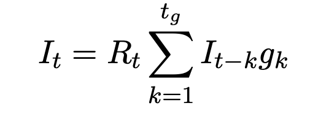

# Bayesian State-Space Model for Estimating R(t)

## Introduction
State-space models (also known as filters), are a class of models used for analysing time-series data. The first state-space model was the Kalman filter, which was an measurement-error correction filter built for guidance systems in the Apollo space program. The basic idea is that there are hidden variables which represent a process and evolve according to a model. Observation of the system are made which are random variables parameterized by the hidden variables. The original Kalman filter is linear with normal random variables and can be solved very efficiently with some clever algorithms. However, modern computers allow us to model much more complex non-linear systems.

## Model
Here we present a (simple) model of an infection process, using a state-space model. The observed data is the time-series of the number of cases (which we use a proxy for infections, this is a simple model without ascertainment modelling). The hidden variables (both time-series) are:
1. Infections - the true number of people infected
2. R - the reproduction number

Each day we could choose *R* so that the observed number of infections was exactly the predicted underlying number infections, however, this would make the estimate of *R* very noisy. Alternatively, we could fit a single *R* to all time-points, however, this would miss the real evoluation of *R* over time. Bayesian state-space model provides a statisitcal framework for finding the most likely split of error between mesurement and the underlying dynamics.

The number of infections are modelled using the renewal equation

where *It* are the number of infections and at time *t*; *Rt* is the instanteous *R* at *t*; and *gt* is the generation time kernel (which we model with a gamma function). The value of *R* changes slowly with time, therefore an AR(1) model is a good candidate model. Since *R* is non-negative, and we expect the absolute value of *R* to change more slowly for small *R* , then we use a log-normal process to model *R*

where *&#963;R* is the daily variation in the underling *R*. Note, if *&#963;R* is large then *R* will be very noisey (i.e. the case when observed cases = underlying infected) and if *&#963;R* is very small than *R* is effectively a constant (i.e. the case of fitting a single *R* to all data). In this model *&#963;* is a parameter and we will sample it from the posterior distribution. Finally, the observed number of cases is modelled using a negative binomial distirbution

where *Ct* are the observed number of cases and *&#966;*od is the over dispersion parameter (note  *&#966;*od=0 is Poisson).
We put priors on all the unknown parameters in the model. The table below summarises the complete model.

The first *tg* case observations are used as the initial conditions for the infections in the renewal equation, therefore the initial time we estimate *Rt* is at *tg+1*.

## Stan Code

We now build this model in Stan. Stan requires the model to be described in a specific format in a series of blocks. The blocks describe different parts of the model and are then re-interpretted by Stan to generate C++ code which is run. The blocks breaks the model up in to conceptually different parts. The Stan code is [here](./src/stan_files/infection_model.stan).

### data 
The *data* block lists all the data inputs in to the model, such as observations and parameters in prior distribution. Every variable must be typed. For our model, the inputs are simply the observed number of cases *Ct* and the parameters for the priors (see table).

### transformed data (optional)
The *transformed data* block contains one off transformations of the input data which are calculated just once at the start of the execution of the model. For our model, we simply remove the first *tg* terms from the observed data which will be used for initial conditions.

### parameters
The *paramaters* block contains all the parameters which are directly sampled in the model. Parameters which have prior distributions which limit the range of values the parameter can take should be specified here. For our model, most of the parameters have priors limiting their values and are applied here.

### transformed parameters (optional)
The *transformed parameters* block is performed after each new sample is drawn and can be used to construct part of the model. The main use of th  *transformed parameters* is that quantities defined it will be included as part of the output. For our model we construct the generation time kernel and *Rt* (which is the main output of the model) 

### model
The *model* block calculate the posterior likeilihood of the data. Both the likelihood of the data given the parmaeters and the prior likelihood of the parameters are included, given the posterior likeliohood is simply the product of the 2 they are not separated. The likelihoods can be specified in one two ways:
1. Using built in distributions e.g. `z_t ~ N(0,1);`
2. Specifiying the lok-likelihood directly e.g. `target += - dot_product( z_t, z_t ) * 0.5;`

